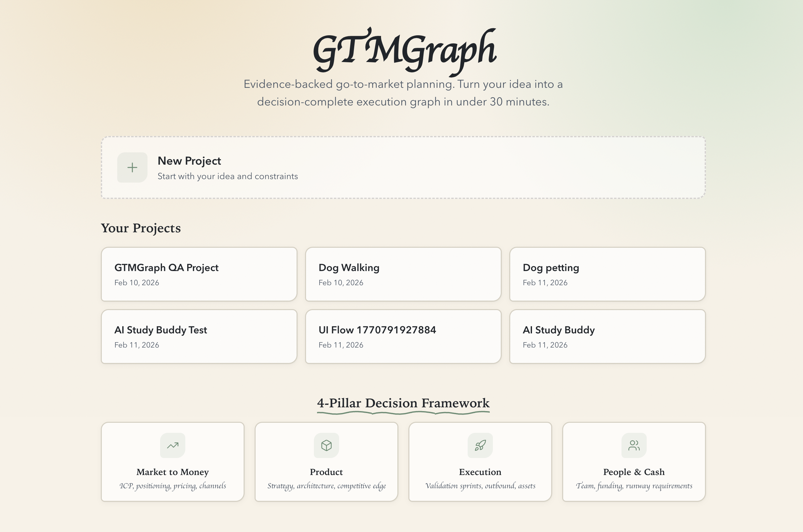
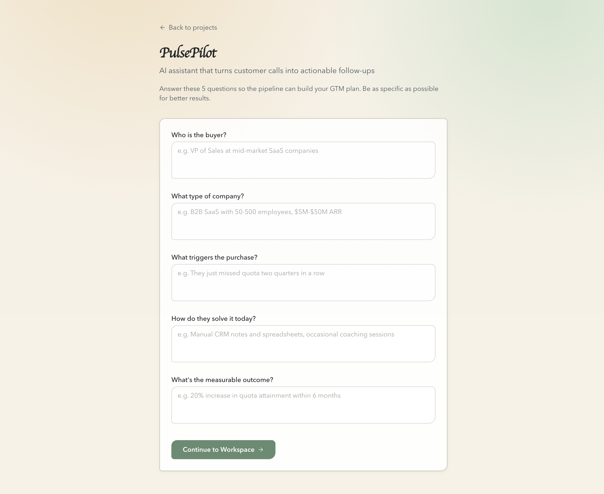
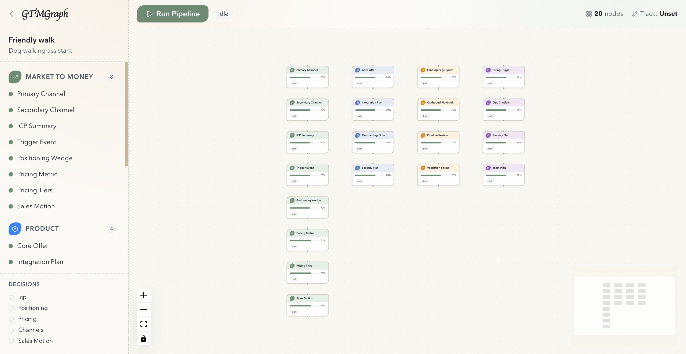

# GTMGraph

Evidence-backed GTM planning system that converts product ideas into decision-complete execution graphs across 6 business pillars.

## Screenshots

### Home Screen


### Project Input Form


### Graph Workspace


## Monorepo Layout

```
apps/web/              Next.js UI (React Flow workspace, decision gates, Zustand state)
services/api/          FastAPI HTTP API + SSE streaming endpoints
services/orchestrator/ Canonical state, merge engine, validator, pipeline runtime
  agents/              13 top-level agents (evidence → graph_builder → validator)
  agents/sub_agents/   Pillar-scoped sub-agents (4 per pillar, 24 total)
  clusters/            Cluster definitions, dependency DAG, registry
  orchestrator/        Orchestrator agent + rules registry
  state/               Default state, merge rules, validation
  tools/               Provider client (Gemini + Perplexity), evidence utils
  fixtures/            Deterministic JSON fixtures for tests & CI
services/worker/       Celery tasks for async run execution
services/export/       Markdown + HTML/PDF export renderer
packages/shared/       JSON schemas (canonical_state, agent_output)
test/                  Product acceptance specs (TC-001 to TC-020)
```

## Architecture Highlights

### Two-Level Agent Pipeline
- **13 top-level agents** run sequentially: `evidence_collector → competitive_teardown → icp → positioning → pricing → channel → sales_motion → product_strategy → tech_feasibility → people_cash → execution → graph_builder → validator`
- **24 sub-agents** organized by pillar (Market Intelligence, Customer, Positioning & Pricing, Go-to-Market, Product & Tech, Execution) — each pillar has 3-4 specialized sub-agents
- **Cluster runtime** orchestrates sub-agent execution within each pillar with dependency management

### Provider System
- **Fixture mode** (default): Deterministic JSON from `services/orchestrator/fixtures/{gemini,perplexity}/` — used in tests and CI
- **Real mode** (`GTMGRAPH_USE_REAL_PROVIDERS=true`): Perplexity API (`sonar-pro`) for evidence retrieval, Gemini API (`gemini-2.0-flash`) for synthesis
- Context extraction and clarification questions always use real Gemini when API key is available

### Canonical State
Single JSON object flowing through the system. Top-level keys: `meta`, `idea`, `constraints`, `inputs`, `evidence`, `decisions`, `pillars`, `graph`, `risks`, `execution`, `telemetry`. Every mutation is validated and snapshotted.

### Merge Rules
- Evidence > Inference > Assumption conflict resolution
- Evidence dedup by normalized URL with max quality score
- Node IDs are stable semantic paths (e.g., `market.icp.summary`, `pricing.metric`)
- Source-less claims auto-downgrade to assumption (confidence capped at 0.6)

### Frontend
- React Flow canvas: Level 1 (6 pillar cards) → Level 2 (detail nodes) drill-down
- Live SSE agent timeline with per-agent progress tracking
- Node detail drawer with evidence, assumptions, and actions
- MCQ clarification intake with adaptive question generation
- Conversational chat intake as primary path

## Quick Start

1. Copy `.env.example` to `.env` and set API keys.
2. Start data services:
   ```bash
   docker compose up -d
   ```
3. Install dependencies:
   ```bash
   uv sync --all-groups
   pnpm install
   ```
4. Apply DB migrations:
   ```bash
   make migrate
   ```
5. Start services:
   ```bash
   make api       # FastAPI on :8000
   make worker    # Celery worker
   pnpm web:dev   # Next.js dev server
   ```

## Testing

```bash
make test                    # All Python tests
uv run pytest -k "test_name" # Single test by name
pnpm web:lint                # Frontend lint
pnpm web:build               # Frontend build check
```

## Environment Variables

| Variable | Description | Default |
|---|---|---|
| `Google_API_Key` | Gemini API key | — |
| `perplexity_api_key` | Perplexity API key | — |
| `GROQ_API_KEY` | GROQ Whisper (audio transcription) | — |
| `DATABASE_URL` | DB connection string | `sqlite+pysqlite:///./artifacts/gtmgraph.db` |
| `REDIS_URL` | Redis connection | `redis://localhost:6379/0` |
| `GTMGRAPH_USE_REAL_PROVIDERS` | Use real APIs vs fixtures | `false` |

## CI

GitHub Actions runs on push to `main` and PRs: Python tests, Ruff lint, web lint, web build.
